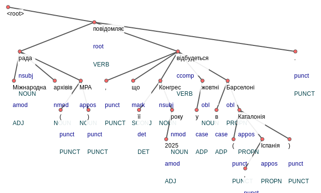

# Deployment of AI Studio app

This contains everything you need to run your app locally.

View your app in AI Studio: https://ai.studio/apps/drive/1tLcaRgHUAMpRAg09qLtJ5Sv3LtqVL__3

## Run Locally

**Prerequisites:**  Node.js

1. Install dependencies:
   `npm install`
2. Set the `GEMINI_API_KEY` in [.env.local](.env.local) to your Gemini API key
3. Run the app:
   `npm run dev`

### processed pics

<svg width="600" height="400">
<g class="_2nS8a" transform="translate(0,10)">
<g class="_R_cI5"><line class="_1fwq5" x1="16.5" y1="4.5" x2="193.21875" y2="35.5" style="stroke-width: 2; stroke: rgb(85, 85, 85);">
<line class="_1fwq5" x1="40.5" y1="95.3125" x2="28.5" y2="155.125" style="stroke-width: 2; stroke: rgb(85, 85, 85);"></line><line class="_1fwq5" x1="40.5" y1="95.3125" x2="112.203125" y2="155.125" style="stroke-width: 2; stroke: rgb(85, 85, 85);"></line><line class="_1fwq5" x1="40.5" y1="95.3125" x2="165.5" y2="155.125" style="stroke-width: 2; stroke: rgb(85, 85, 85);"></line><line class="_1fwq5" x1="165.5" y1="155.125" x2="124.203125" y2="214.9375" style="stroke-width: 2; stroke: rgb(85, 85, 85);"></line><line class="_1fwq5" x1="165.5" y1="155.125" x2="181.21875" y2="214.9375" style="stroke-width: 2; stroke: rgb(85, 85, 85);"></line><line class="_1fwq5" x1="193.21875" y1="35.5" x2="40.5" y2="95.3125" style="stroke-width: 2; stroke: rgb(85, 85, 85);"></line><line class="_1fwq5" x1="193.21875" y1="35.5" x2="364.53125" y2="95.3125" style="stroke-width: 2; stroke: rgb(85, 85, 85);"></line><line class="_1fwq5" x1="193.21875" y1="35.5" x2="605.1875" y2="95.3125" style="stroke-width: 2; stroke: rgb(85, 85, 85);"></line><line class="_1fwq5" x1="328.53125" y1="155.125" x2="284.859375" y2="214.9375" style="stroke-width: 2; stroke: rgb(85, 85, 85);"></line><line class="_1fwq5" x1="328.53125" y1="155.125" x2="352.53125" y2="214.9375" style="stroke-width: 2; stroke: rgb(85, 85, 85);"></line><line class="_1fwq5" x1="352.53125" y1="214.9375" x2="340.53125" y2="274.75" style="stroke-width: 2; stroke: rgb(85, 85, 85);"></line><line class="_1fwq5" x1="364.53125" y1="95.3125" x2="217.84375" y2="155.125" style="stroke-width: 2; stroke: rgb(85, 85, 85);"></line><line class="_1fwq5" x1="364.53125" y1="95.3125" x2="272.859375" y2="155.125" style="stroke-width: 2; stroke: rgb(85, 85, 85);"></line><line class="_1fwq5" x1="364.53125" y1="95.3125" x2="328.53125" y2="155.125" style="stroke-width: 2; stroke: rgb(85, 85, 85);"></line><line class="_1fwq5" x1="364.53125" y1="95.3125" x2="414.875" y2="155.125" style="stroke-width: 2; stroke: rgb(85, 85, 85);"></line><line class="_1fwq5" x1="364.53125" y1="95.3125" x2="466.484375" y2="155.125" style="stroke-width: 2; stroke: rgb(85, 85, 85);"></line><line class="_1fwq5" x1="414.875" y1="155.125" x2="402.875" y2="214.9375" style="stroke-width: 2; stroke: rgb(85, 85, 85);"></line><line class="_1fwq5" x1="466.484375" y1="155.125" x2="443.5625" y2="214.9375" style="stroke-width: 2; stroke: rgb(85, 85, 85);"></line><line class="_1fwq5" x1="466.484375" y1="155.125" x2="490.484375" y2="214.9375" style="stroke-width: 2; stroke: rgb(85, 85, 85);"></line><line class="_1fwq5" x1="490.484375" y1="214.9375" x2="478.484375" y2="274.75" style="stroke-width: 2; stroke: rgb(85, 85, 85);"></line><line class="_1fwq5" x1="490.484375" y1="214.9375" x2="537.5" y2="274.75" style="stroke-width: 2; stroke: rgb(85, 85, 85);"></line><line class="_1fwq5" x1="490.484375" y1="214.9375" x2="593.1875" y2="274.75" style="stroke-width: 2; stroke: rgb(85, 85, 85);"></line><line class="_1fwq5" x1="537.5" y1="274.75" x2="502.484375" y2="334.5625" style="stroke-width: 2; stroke: rgb(85, 85, 85);"></line></g><g class="_3criC"><g class="_19NMQ" id="w0" transform="translate(12,0)"><circle r="3.5" cx="4.5" cy="4.5" style="stroke: rgb(85, 85, 85); stroke-width: 1; fill: rgb(255, 102, 102);"></circle><rect x="0" y="9" fill="white" style="fill-opacity: 0.9;" width="35.703125" height="16"></rect><text dx="1" dy="22" style="text-anchor: start; font-family: Arial; font-size: 12px; line-height: normal;"><tspan x="1">&lt;root&gt;</tspan><tspan dy="14.399999999999999" x="1"></tspan><tspan dy="14.399999999999999" x="1"></tspan></text></g><g class="_19NMQ" id="w1" transform="translate(24,150.625)"><circle r="3.5" cx="4.5" cy="4.5" style="stroke: rgb(85, 85, 85); stroke-width: 1; fill: rgb(255, 102, 102);"></circle><rect x="0" y="9" fill="white" style="fill-opacity: 0.9;" width="69.703125" height="44.8125"></rect><text dx="1" dy="22" style="text-anchor: start; font-family: Arial; font-size: 12px; line-height: normal;"><tspan x="1">Міжнародна</tspan><tspan dy="14.399999999999999" x="1" fill="#00008b">amod</tspan><tspan dy="14.399999999999999" x="1" fill="#004048">ADJ</tspan></text></g><g class="_19NMQ" id="w2" transform="translate(36,90.8125)"><circle r="3.5" cx="4.5" cy="4.5" style="stroke: rgb(85, 85, 85); stroke-width: 1; fill: rgb(255, 102, 102);"></circle><rect x="0" y="9" fill="white" style="fill-opacity: 0.9;" width="36.34375" height="44.8125"></rect><text dx="1" dy="22" style="text-anchor: start; font-family: Arial; font-size: 12px; line-height: normal;"><tspan x="1">рада</tspan><tspan dy="14.399999999999999" x="1" fill="#00008b">nsubj</tspan><tspan dy="14.399999999999999" x="1" fill="#004048">NOUN</tspan></text></g><g class="_19NMQ" id="w3" transform="translate(107.703125,150.625)"><circle r="3.5" cx="4.5" cy="4.5" style="stroke: rgb(85, 85, 85); stroke-width: 1; fill: rgb(255, 102, 102);"></circle><rect x="0" y="9" fill="white" style="fill-opacity: 0.9;" width="39.296875" height="44.8125"></rect><text dx="1" dy="22" style="text-anchor: start; font-family: Arial; font-size: 12px; line-height: normal;"><tspan x="1">архівів</tspan><tspan dy="14.399999999999999" x="1" fill="#00008b">nmod</tspan><tspan dy="14.399999999999999" x="1" fill="#004048">NOUN</tspan></text></g><g class="_19NMQ" id="w4" transform="translate(119.703125,210.4375)"><circle r="3.5" cx="4.5" cy="4.5" style="stroke: rgb(85, 85, 85); stroke-width: 1; fill: rgb(255, 102, 102);"></circle><rect x="0" y="9" fill="white" style="fill-opacity: 0.9;" width="43.015625" height="44.8125"></rect><text dx="1" dy="22" style="text-anchor: start; font-family: Arial; font-size: 12px; line-height: normal;"><tspan x="1">(</tspan><tspan dy="14.399999999999999" x="1" fill="#00008b">punct</tspan><tspan dy="14.399999999999999" x="1" fill="#004048">PUNCT</tspan></text></g><g class="_19NMQ" id="w5" transform="translate(161,150.625)"><circle r="3.5" cx="4.5" cy="4.5" style="stroke: rgb(85, 85, 85); stroke-width: 1; fill: rgb(255, 102, 102);"></circle><rect x="0" y="9" fill="white" style="fill-opacity: 0.9;" width="36.34375" height="44.8125"></rect><text dx="1" dy="22" style="text-anchor: start; font-family: Arial; font-size: 12px; line-height: normal;"><tspan x="1">МРА</tspan><tspan dy="14.399999999999999" x="1" fill="#00008b">appos</tspan><tspan dy="14.399999999999999" x="1" fill="#004048">NOUN</tspan></text></g><g class="_19NMQ" id="w6" transform="translate(176.71875,210.4375)"><circle r="3.5" cx="4.5" cy="4.5" style="stroke: rgb(85, 85, 85); stroke-width: 1; fill: rgb(255, 102, 102);"></circle><rect x="0" y="9" fill="white" style="fill-opacity: 0.9;" width="43.015625" height="44.8125"></rect><text dx="1" dy="22" style="text-anchor: start; font-family: Arial; font-size: 12px; line-height: normal;"><tspan x="1">)</tspan><tspan dy="14.399999999999999" x="1" fill="#00008b">punct</tspan><tspan dy="14.399999999999999" x="1" fill="#004048">PUNCT</tspan></text></g><g class="_19NMQ" id="w7" transform="translate(188.71875,31)"><circle r="3.5" cx="4.5" cy="4.5" style="stroke: rgb(85, 85, 85); stroke-width: 1; fill: rgb(255, 102, 102);"></circle><rect x="0" y="9" fill="white" style="fill-opacity: 0.9;" width="65.765625" height="44.8125"></rect><text dx="1" dy="22" style="text-anchor: start; font-family: Arial; font-size: 12px; line-height: normal;"><tspan x="1">повідомляє</tspan><tspan dy="14.399999999999999" x="1" fill="#00008b">root</tspan><tspan dy="14.399999999999999" x="1" fill="#004048">VERB</tspan></text></g><g class="_19NMQ" id="w8" transform="translate(213.34375,150.625)"><circle r="3.5" cx="4.5" cy="4.5" style="stroke: rgb(85, 85, 85); stroke-width: 1; fill: rgb(255, 102, 102);"></circle><rect x="0" y="9" fill="white" style="fill-opacity: 0.9;" width="43.015625" height="44.8125"></rect><text dx="1" dy="22" style="text-anchor: start; font-family: Arial; font-size: 12px; line-height: normal;"><tspan x="1">,</tspan><tspan dy="14.399999999999999" x="1" fill="#00008b">punct</tspan><tspan dy="14.399999999999999" x="1" fill="#004048">PUNCT</tspan></text></g><g class="_19NMQ" id="w9" transform="translate(268.359375,150.625)"><circle r="3.5" cx="4.5" cy="4.5" style="stroke: rgb(85, 85, 85); stroke-width: 1; fill: rgb(255, 102, 102);"></circle><rect x="0" y="9" fill="white" style="fill-opacity: 0.9;" width="41.671875" height="44.8125"></rect><text dx="1" dy="22" style="text-anchor: start; font-family: Arial; font-size: 12px; line-height: normal;"><tspan x="1">що</tspan><tspan dy="14.399999999999999" x="1" fill="#00008b">mark</tspan><tspan dy="14.399999999999999" x="1" fill="#004048">SCONJ</tspan></text></g><g class="_19NMQ" id="w10" transform="translate(280.359375,210.4375)"><circle r="3.5" cx="4.5" cy="4.5" style="stroke: rgb(85, 85, 85); stroke-width: 1; fill: rgb(255, 102, 102);"></circle><rect x="0" y="9" fill="white" style="fill-opacity: 0.9;" width="25.671875" height="44.8125"></rect><text dx="1" dy="22" style="text-anchor: start; font-family: Arial; font-size: 12px; line-height: normal;"><tspan x="1">її</tspan><tspan dy="14.399999999999999" x="1" fill="#00008b">det</tspan><tspan dy="14.399999999999999" x="1" fill="#004048">DET</tspan></text></g><g class="_19NMQ" id="w11" transform="translate(324.03125,150.625)"><circle r="3.5" cx="4.5" cy="4.5" style="stroke: rgb(85, 85, 85); stroke-width: 1; fill: rgb(255, 102, 102);"></circle><rect x="0" y="9" fill="white" style="fill-opacity: 0.9;" width="46.015625" height="44.8125"></rect><text dx="1" dy="22" style="text-anchor: start; font-family: Arial; font-size: 12px; line-height: normal;"><tspan x="1">Конгрес</tspan><tspan dy="14.399999999999999" x="1" fill="#00008b">nsubj</tspan><tspan dy="14.399999999999999" x="1" fill="#004048">NOUN</tspan></text></g><g class="_19NMQ" id="w12" transform="translate(336.03125,270.25)"><circle r="3.5" cx="4.5" cy="4.5" style="stroke: rgb(85, 85, 85); stroke-width: 1; fill: rgb(255, 102, 102);"></circle><rect x="0" y="9" fill="white" style="fill-opacity: 0.9;" width="31.03125" height="44.8125"></rect><text dx="1" dy="22" style="text-anchor: start; font-family: Arial; font-size: 12px; line-height: normal;"><tspan x="1">2025</tspan><tspan dy="14.399999999999999" x="1" fill="#00008b">amod</tspan><tspan dy="14.399999999999999" x="1" fill="#004048">ADJ</tspan></text></g><g class="_19NMQ" id="w13" transform="translate(348.03125,210.4375)"><circle r="3.5" cx="4.5" cy="4.5" style="stroke: rgb(85, 85, 85); stroke-width: 1; fill: rgb(255, 102, 102);"></circle><rect x="0" y="9" fill="white" style="fill-opacity: 0.9;" width="36.34375" height="44.8125"></rect><text dx="1" dy="22" style="text-anchor: start; font-family: Arial; font-size: 12px; line-height: normal;"><tspan x="1">року</tspan><tspan dy="14.399999999999999" x="1" fill="#00008b">nmod</tspan><tspan dy="14.399999999999999" x="1" fill="#004048">NOUN</tspan></text></g><g class="_19NMQ" id="w14" transform="translate(360.03125,90.8125)"><circle r="3.5" cx="4.5" cy="4.5" style="stroke: rgb(85, 85, 85); stroke-width: 1; fill: rgb(255, 102, 102);"></circle><rect x="0" y="9" fill="white" style="fill-opacity: 0.9;" width="67.78125" height="44.8125"></rect><text dx="1" dy="22" style="text-anchor: start; font-family: Arial; font-size: 12px; line-height: normal;"><tspan x="1">відбудеться</tspan><tspan dy="14.399999999999999" x="1" fill="#00008b">ccomp</tspan><tspan dy="14.399999999999999" x="1" fill="#004048">VERB</tspan></text></g><g class="_19NMQ" id="w15" transform="translate(398.375,210.4375)"><circle r="3.5" cx="4.5" cy="4.5" style="stroke: rgb(85, 85, 85); stroke-width: 1; fill: rgb(255, 102, 102);"></circle><rect x="0" y="9" fill="white" style="fill-opacity: 0.9;" width="26.6875" height="44.8125"></rect><text dx="1" dy="22" style="text-anchor: start; font-family: Arial; font-size: 12px; line-height: normal;"><tspan x="1">у</tspan><tspan dy="14.399999999999999" x="1" fill="#00008b">case</tspan><tspan dy="14.399999999999999" x="1" fill="#004048">ADP</tspan></text></g><g class="_19NMQ" id="w16" transform="translate(410.375,150.625)"><circle r="3.5" cx="4.5" cy="4.5" style="stroke: rgb(85, 85, 85); stroke-width: 1; fill: rgb(255, 102, 102);"></circle><rect x="0" y="9" fill="white" style="fill-opacity: 0.9;" width="37.609375" height="44.8125"></rect><text dx="1" dy="22" style="text-anchor: start; font-family: Arial; font-size: 12px; line-height: normal;"><tspan x="1">жовтні</tspan><tspan dy="14.399999999999999" x="1" fill="#00008b">obl</tspan><tspan dy="14.399999999999999" x="1" fill="#004048">NOUN</tspan></text></g><g class="_19NMQ" id="w17" transform="translate(439.0625,210.4375)"><circle r="3.5" cx="4.5" cy="4.5" style="stroke: rgb(85, 85, 85); stroke-width: 1; fill: rgb(255, 102, 102);"></circle><rect x="0" y="9" fill="white" style="fill-opacity: 0.9;" width="26.6875" height="44.8125"></rect><text dx="1" dy="22" style="text-anchor: start; font-family: Arial; font-size: 12px; line-height: normal;"><tspan x="1">в</tspan><tspan dy="14.399999999999999" x="1" fill="#00008b">case</tspan><tspan dy="14.399999999999999" x="1" fill="#004048">ADP</tspan></text></g><g class="_19NMQ" id="w18" transform="translate(461.984375,150.625)"><circle r="3.5" cx="4.5" cy="4.5" style="stroke: rgb(85, 85, 85); stroke-width: 1; fill: rgb(255, 102, 102);"></circle><rect x="0" y="9" fill="white" style="fill-opacity: 0.9;" width="58.609375" height="44.8125"></rect><text dx="1" dy="22" style="text-anchor: start; font-family: Arial; font-size: 12px; line-height: normal;"><tspan x="1">Барселоні</tspan><tspan dy="14.399999999999999" x="1" fill="#00008b">obl</tspan><tspan dy="14.399999999999999" x="1" fill="#004048">PROPN</tspan></text></g><g class="_19NMQ" id="w19" transform="translate(473.984375,270.25)"><circle r="3.5" cx="4.5" cy="4.5" style="stroke: rgb(85, 85, 85); stroke-width: 1; fill: rgb(255, 102, 102);"></circle><rect x="0" y="9" fill="white" style="fill-opacity: 0.9;" width="43.015625" height="44.8125"></rect><text dx="1" dy="22" style="text-anchor: start; font-family: Arial; font-size: 12px; line-height: normal;"><tspan x="1">(</tspan><tspan dy="14.399999999999999" x="1" fill="#00008b">punct</tspan><tspan dy="14.399999999999999" x="1" fill="#004048">PUNCT</tspan></text></g><g class="_19NMQ" id="w20" transform="translate(485.984375,210.4375)"><circle r="3.5" cx="4.5" cy="4.5" style="stroke: rgb(85, 85, 85); stroke-width: 1; fill: rgb(255, 102, 102);"></circle><rect x="0" y="9" fill="white" style="fill-opacity: 0.9;" width="57.046875" height="44.8125"></rect><text dx="1" dy="22" style="text-anchor: start; font-family: Arial; font-size: 12px; line-height: normal;"><tspan x="1">Каталонія</tspan><tspan dy="14.399999999999999" x="1" fill="#00008b">appos</tspan><tspan dy="14.399999999999999" x="1" fill="#004048">PROPN</tspan></text></g><g class="_19NMQ" id="w21" transform="translate(497.984375,330.0625)"><circle r="3.5" cx="4.5" cy="4.5" style="stroke: rgb(85, 85, 85); stroke-width: 1; fill: rgb(255, 102, 102);"></circle><rect x="0" y="9" fill="white" style="fill-opacity: 0.9;" width="43.015625" height="44.8125"></rect><text dx="1" dy="22" style="text-anchor: start; font-family: Arial; font-size: 12px; line-height: normal;"><tspan x="1">,</tspan><tspan dy="14.399999999999999" x="1" fill="#00008b">punct</tspan><tspan dy="14.399999999999999" x="1" fill="#004048">PUNCT</tspan></text></g><g class="_19NMQ" id="w22" transform="translate(533,270.25)"><circle r="3.5" cx="4.5" cy="4.5" style="stroke: rgb(85, 85, 85); stroke-width: 1; fill: rgb(255, 102, 102);"></circle><rect x="0" y="9" fill="white" style="fill-opacity: 0.9;" width="43.6875" height="44.8125"></rect><text dx="1" dy="22" style="text-anchor: start; font-family: Arial; font-size: 12px; line-height: normal;"><tspan x="1">Іспанія</tspan><tspan dy="14.399999999999999" x="1" fill="#00008b">appos</tspan><tspan dy="14.399999999999999" x="1" fill="#004048">PROPN</tspan></text></g><g class="_19NMQ" id="w23" transform="translate(588.6875,270.25)"><circle r="3.5" cx="4.5" cy="4.5" style="stroke: rgb(85, 85, 85); stroke-width: 1; fill: rgb(255, 102, 102);"></circle><rect x="0" y="9" fill="white" style="fill-opacity: 0.9;" width="43.015625" height="44.8125"></rect><text dx="1" dy="22" style="text-anchor: start; font-family: Arial; font-size: 12px; line-height: normal;"><tspan x="1">)</tspan><tspan dy="14.399999999999999" x="1" fill="#00008b">punct</tspan><tspan dy="14.399999999999999" x="1" fill="#004048">PUNCT</tspan></text></g><g class="_19NMQ" id="w24" transform="translate(600.6875,90.8125)"><circle r="3.5" cx="4.5" cy="4.5" style="stroke: rgb(85, 85, 85); stroke-width: 1; fill: rgb(255, 102, 102);"></circle><rect x="0" y="9" fill="white" style="fill-opacity: 0.9;" width="43.015625" height="44.8125"></rect><text dx="1" dy="22" style="text-anchor: start; font-family: Arial; font-size: 12px; line-height: normal;"><tspan x="1">.</tspan><tspan dy="14.399999999999999" x="1" fill="#00008b">punct</tspan><tspan dy="14.399999999999999" x="1" fill="#004048">PUNCT</tspan></text></g></g><g class="_R_cI5"></g><g class="_3criC"></g><g class="_R_cI5"></g><g class="_3criC"></g><g class="_R_cI5"></g><g class="_3criC"></g><g class="_R_cI5"></g><g class="_3criC"></g><g class="_R_cI5"></g><g class="_3criC"></g><g class="_R_cI5"></g><g class="_3criC"></g><g class="_R_cI5"></g><g class="_3criC"></g><g class="_R_cI5"></g><g class="_3criC"></g></g></svg>

----

